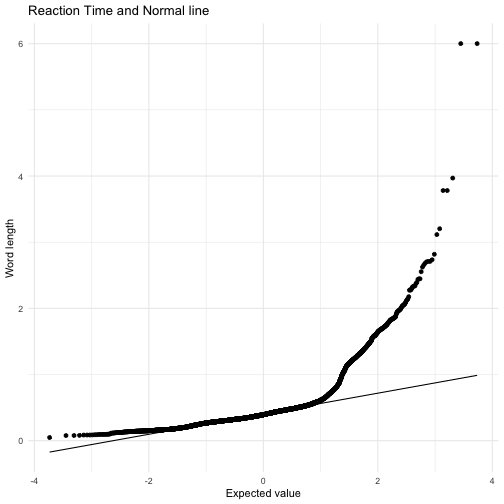
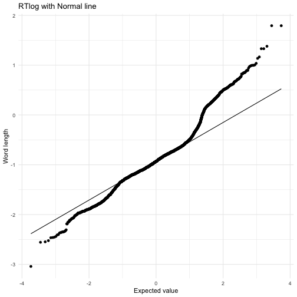
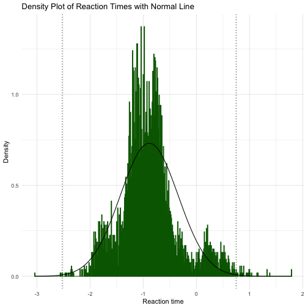
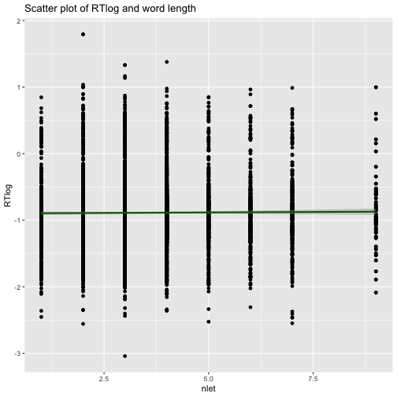
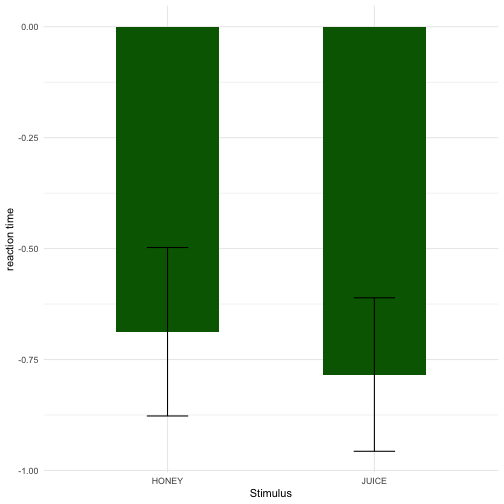

# Preparing my data

I start out cleaning my data


```r
clean_data <- data %>% select(-c(RT2))

# The letters in the collumn 'Words' are converted into uppercase:
clean_data$Word <- toupper(clean_data$Word)
# All the punctuations are removed:
clean_data$Word <- str_replace_all(clean_data$Word, "[:punct:]", "")
# The collumn 'Word' are renamed to 'word':
colnames(clean_data)[colnames(clean_data) == "Word"] <- "word"

MRC <- read_csv("MRC_database.csv")
```

```
## Parsed with column specification:
## cols(
##   nlet = col_double(),
##   nsyl = col_double(),
##   kf_freq = col_double(),
##   kf_ncats = col_double(),
##   kf_nsamp = col_double(),
##   tl_freq = col_double(),
##   brown_freq = col_double(),
##   fam = col_double(),
##   conc = col_double(),
##   imag = col_double(),
##   meanc = col_double(),
##   meanp = col_double(),
##   aoa = col_double(),
##   word = col_character()
## )
```

```r
merged_data <- merge(clean_data, MRC, by = "word")
```


A qq-plot is made to check the data for normal distribution:


```r
ggplot(merged_data, aes(sample = RT)) + stat_qq() + stat_qq_line() + labs(title = "Reaction Time and Normal line", y = "Word length", x = "Expected value") + theme_minimal()
```




The reaction time data are transformed by using log, to make it normally distibuted:


```r
#A new collumn called RTlog is created:
merged_data$RTlog <- log(merged_data$RT)

#The transformed RT data are now again checked to be normally distributed:

ggplot(merged_data, aes(sample = RTlog)) + stat_qq() + stat_qq_line() + labs(title = "RTlog with Normal line", y = "Word length", x = "Expected value") + theme_minimal()
```




The transformed RTlog data are plotted in a density plot:


```r
ggplot(merged_data, aes(x = RTlog)) + geom_vline(data = merged_data, aes(xintercept = mean(RTlog) + 3*sd(RTlog)), colour = "black", linetype = "dotted") + geom_vline(data = merged_data, aes(xintercept = mean(RTlog) - 3*sd(RTlog)), colour = "black", linetype = "dotted") + geom_histogram(aes(y = ..density..), color = "darkgreen", fill = "darkgreen", binwidth = .01) + stat_function(fun = dnorm, args = list(mean = mean(merged_data$RTlog, na.rm = TRUE), sd = sd(merged_data$RTlog, na.rm = TRUE)), colour = "black", size = 0.5) + labs(title = "Density Plot of Reaction Times with Normal Line", y = "Density", x = "Reaction time") + theme_minimal()
```




Outliers that are more than 3 sd from the mean are removed:


```r
#Outliers are removed:
sd <- sd(merged_data$RTlog)
mean1 <- mean(merged_data$RTlog)
merged_data2 <- merged_data[-c(merged_data$RTlog > mean1 + 3*sd | merged_data$RTlog < mean1 - 3*sd),]
```


The data are again plotted, this time wihtout outliers:


```r
ggplot(merged_data2, aes(x = RTlog)) + geom_vline(data = merged_data2, aes(xintercept = mean(RTlog) + 3*sd(RTlog)), colour = "black", linetype = "dotted") + geom_vline(data = merged_data2, aes(xintercept = mean(RTlog) - 3*sd(RTlog)), colour = "black", linetype = "dotted") + geom_histogram(aes(y = ..density..), color = "darkgreen", fill = "darkgreen", binwidth = .01) + stat_function(fun = dnorm, args = list(mean = mean(merged_data2$RTlog, na.rm = TRUE), sd = sd(merged_data2$RTlog, na.rm = TRUE)), colour = "black", size = 1) + labs(title = "Density Plot of Reaction Times with Normal Line", y = "Density", x = "Reaction time") + theme_minimal()
```


The data are now normally distributed and without outliers. The number of observations are above the limit of 5000, so the norm.test is not being used. 


# Part 1

Testing for correlation between the reading time and the lenght of the word:


```r
# Testing for correlation by making scatterplot
ggplot(merged_data2, aes(nlet, RTlog)) + geom_point() + geom_smooth(method = "lm", colour = "darkgreen") + ggtitle('Scatter plot of RTlog and word length')
```



```r
# Testing for correlation by making cor.test
cor.test(merged_data2$nlet, merged_data2$RTlog, method = "pearson")
```

```
## 
## 	Pearson's product-moment correlation
## 
## data:  merged_data2$nlet and merged_data2$RTlog
## t = 0.67452, df = 5316, p-value = 0.5
## alternative hypothesis: true correlation is not equal to 0
## 95 percent confidence interval:
##  -0.01763117  0.03611960
## sample estimates:
##         cor 
## 0.009250897
```


Testing  for correlation between the reading time and the frequency of the word:


```r
# Testing for correlation by making scatterplot
ggplot(updated_merged_data, aes(kf_freq, RTlog)) + geom_point() + geom_smooth(method = "lm", colour = "darkgreen") + ggtitle('Scatter plot of RTlog and word frequency')
```

```
## Error in ggplot(updated_merged_data, aes(kf_freq, RTlog)): objekt 'updated_merged_data' blev ikke fundet
```

```r
# Testing for correlation test by making cor.test
cor.test(updated_merged_data$kf_freq, updated_merged_data$RTlog, method = "pearson")
```

```
## Error in cor.test(updated_merged_data$kf_freq, updated_merged_data$RTlog, : objekt 'updated_merged_data' blev ikke fundet
```


Testing for correlation between reading time and the location of the word in the text:


```r
# Testing for correlation by making scatterplot
ggplot(updated_merged_data, aes(X, RTlog)) + geom_point() + geom_smooth(method = "lm", colour = "darkgreen") + ggtitle('Scatter plot of RTlog and the words location in the text')
```

```
## Error in ggplot(updated_merged_data, aes(X, RTlog)): objekt 'updated_merged_data' blev ikke fundet
```

```r
# Testing for correlation test by making cor.test
cor.test(updated_merged_data$X, updated_merged_data$RTlog, method = "pearson")
```

```
## Error in cor.test(updated_merged_data$X, updated_merged_data$RTlog, method = "pearson"): objekt 'updated_merged_data' blev ikke fundet
```


# Part 2

A new data frame is made, only including the words "juice" and "honey"


```r
# New data frame is created
data_jh <- filter(merged_data2, X == 160)

ggplot(data_jh, aes(x = word, y = RTlog)) + geom_bar(stat = 'summary', fun.y = mean, width = 0.5, fill = "darkgreen") + geom_errorbar(stat = 'summary', fun.data = mean_se, width = 0.2) + labs(x = "Stimulus", y = "reaction time") + theme_minimal()
```




A t-test is made between the mean reading time of the two words


```r
t.test(data_jh$RTlog ~ data_jh$word)
```

```
## 
## 	Welch Two Sample t-test
## 
## data:  data_jh$RTlog by data_jh$word
## t = 0.37558, df = 20.232, p-value = 0.7111
## alternative hypothesis: true difference in means is not equal to 0
## 95 percent confidence interval:
##  -0.4388002  0.6316852
## sample estimates:
## mean in group HONEY mean in group JUICE 
##          -0.6874132          -0.7838557
```


The mean of the two words are:
Honey = 
Juice = 

The errorbars in the ggplot overlaps, which means that the difference between the two means are not significantly different. Also the given p-value from the t-test indicates that there is no significant difference, since it is 0.7, which is above the threshold of 0.5.
